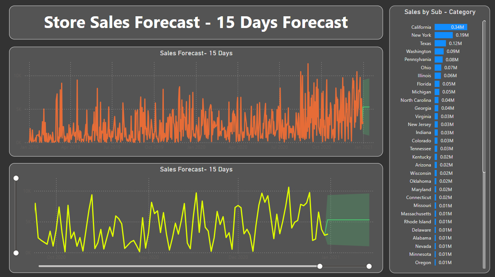

# Power BI Project: Store Sales Analysis and Forecasting

An interactive Power BI dashboard to analyze store sales, visualize trends, and forecast future performance for strategic decision-making.

---

## Features

### 1. **Store Sales Dashboard**
   - **KPIs**:
     - **Total Sales**: `$1.57M`
     - **Total Quantity Sold**: `22K`
     - **Total Profit**: `$175.26K`
     - **Average Delivery Time**: `4 days`
     - **Number of States Covered**: `49`
   - **Filters**:
     - Regional selection: `Central`, `East`, `South`, `West`.

   - **Charts**:
     - **Sum of Sales by Segment**: 
       - Distribution among `Home Office`, `Consumer`, and `Corporate` segments.
     - **Monthly Sales and Profit Year-over-Year (YoY)**:
       - Line charts comparing sales and profit trends across 2019 and 2020.
     - **Sum of Sales by Payment Mode**:
       - Sales breakdown by `Cards`, `COD`, and `Online` payment methods.
     - **Sales by Ship Mode**:
       - Distribution across `Standard`, `Second Class`, `First Class`, and `Same Day` modes.
     - **Sales by Category and Sub-Category**:
       - Performance of categories like `Office Supplies`, `Technology`, and `Furniture`.
       - Sub-categories such as `Phones`, `Chairs`, and `Binders`.
     - **Geographical Sales Distribution**:
       - Map visual showing the sum of sales and profit by state.

   **Use Case**: 
   - Gain actionable insights into sales trends and performance across regions, categories, and customer segments.

   **Preview**:  
   

---

### 2. **Store Sales Forecast (15 Days)**
   - **Visual 1 (Top Graph)**: 
     - Displays the sales forecast for the next 15 days using a time-series model.
     - The orange line shows the historical sales data, while the green area represents the forecasted values.
   - **Visual 2 (Bottom Graph)**: 
     - Highlights another perspective of the sales forecast for the same period.
     - The yellow line shows a smoothed trend with projected values indicated in the green shaded area.

   **Use Case**: 
   - Predict sales to optimize inventory and resource allocation.

   **Preview**:  
   

---

## Tools and Technologies
- **Power BI**:
  - For creating visuals, analyzing data, and building dashboards.
- **Dataset**:
  - Sales data including metrics like sales amount, profit, product category, shipping modes, payment methods, and regions.
- **Forecasting**:
  - Time-series analysis for predicting sales using built-in Power BI forecasting tools.

---

## How to Use
1. Clone the repository:
   ```bash
   git clone https://github.com/himanshu-gaurav/Sales_Date_Analysis_PowerBI_Dashboard.git
2. Open the .pbix file in Power BI Desktop.
3. Explore the dashboard and interact with filters for detailed insights.

---
